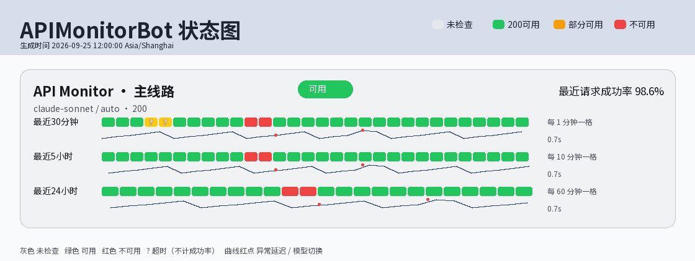
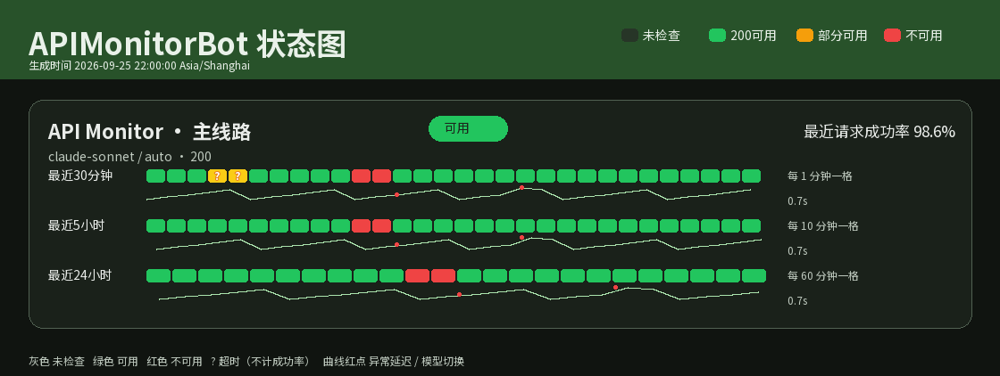
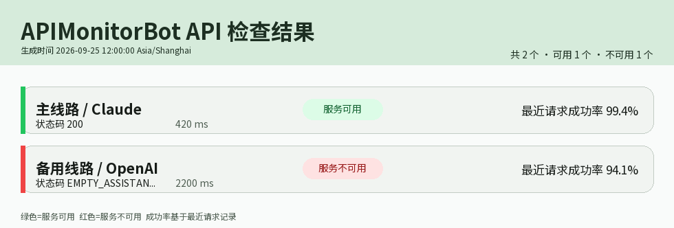
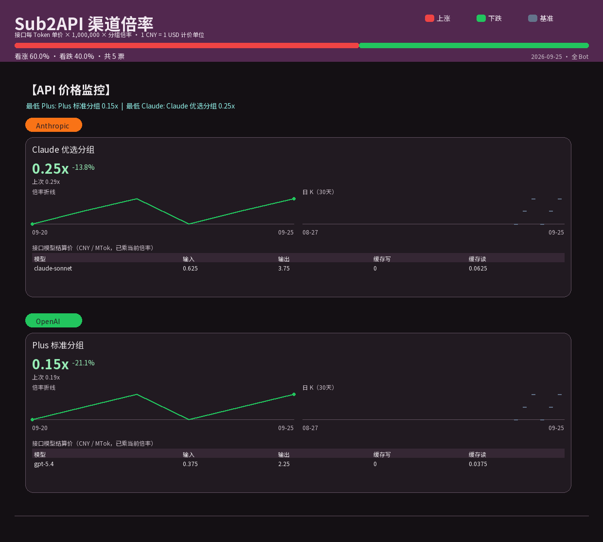
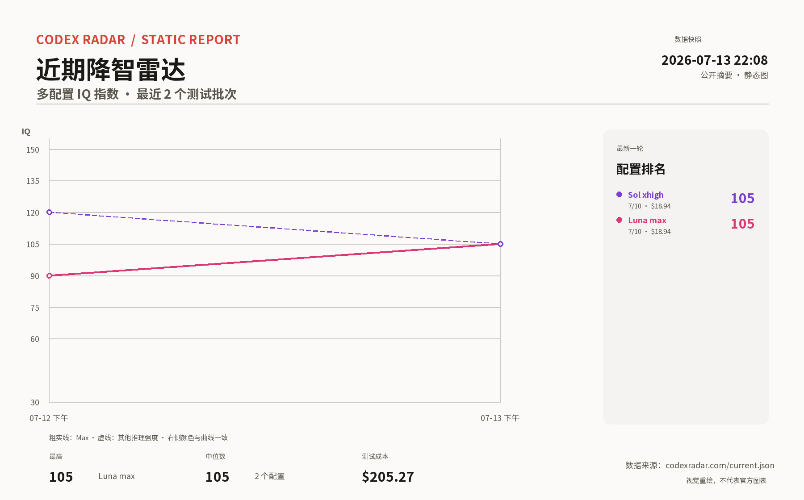
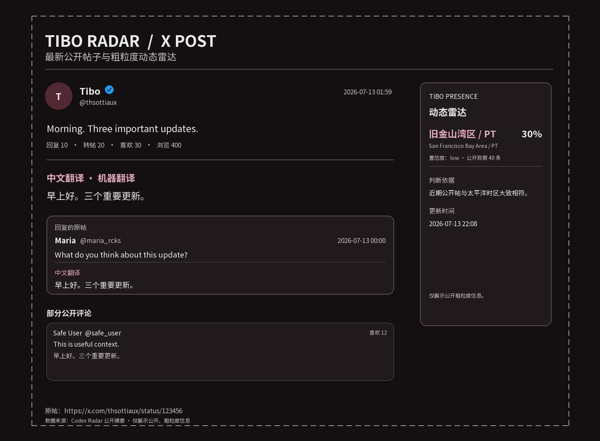

# APIMonitorBot

面向 OpenAI / Anthropic 兼容接口的 API 可用性监控与 QQ 通知机器人。

在一个 WebUI 中管理多个 API、查看状态和延迟、跟踪渠道倍率，并通过 OneBot v11 将故障、恢复和价格变化发送到指定群聊或私聊。适合本机或自托管部署，不包含网关观测、请求转发或 GPT-5.6 掺水检测。

## 效果预览

以下图片由项目真实渲染器使用**离线演示数据**生成，不代表实际服务可用性、模型表现或报价。图片随仓库保存，无需运行服务即可查看。

### API 状态与延迟

状态条和延迟曲线分别展示最近 30 分钟、5 小时及 24 小时的数据。

| 北京时间白天 · 浅色 | 北京时间夜间 · 深色 |
| --- | --- |
|  |  |

### 即时检查与渠道价格

| 多接口检查结果 | 渠道倍率、历史走势与模型价格 |
| --- | --- |
|  |  |

<details>
<summary>更多图片：Radar 与 Tibo</summary>





</details>

自产报告图片共用 Material 3 风格的色彩角色、字体和布局。每次渲染重新选择主题色，北京时间 **07:00 至 19:00 为浅色，其余时间为深色**；成功、失败、涨跌等语义色保持一致。`/stat` 是真实网页截图，不参与重绘。

## 主要功能

| 模块 | 能力 |
| --- | --- |
| API 监控 | 多配置、协议选择、定时巡检、失败复核、模型回退、故障与恢复通知 |
| 状态分析 | 滚动 24 小时成功率、三档时间窗口、独立超时展示、延迟曲线及异常标记 |
| QQ 机器人 | OneBot v11 WebSocket 收发、群聊与私聊通知、多目标绑定、管理员权限、命令开关与别名 |
| 渠道价格 | Sub2API 倍率监控、模型价格表、历史折线、30 日日 K、看涨/看跌投票、Sub2API/NewAPI 地址导入 |
| 管理后台 | 登录鉴权、配置管理、巡检历史、消息记录、巡检参数、管理员管理、本地升级 |
| 公开状态 | 默认关闭的 `/status` 页面，按分组开放，只读取本地快照 |
| 群聊情报 | 默认关闭、群白名单、上下文采集、规则筛选、可选 LLM 分析、管理员报告 |
| 扩展报告 | Codex Radar 公开趋势摘要、Tibo 公开动态与中文翻译、外部状态页截图 |

后端使用 **FastAPI + SQLAlchemy + SQLite + APScheduler**，前端使用 **React + TypeScript + Vite**，图片使用 **Pillow + Noto Sans SC**。

## 快速部署

下面以 Windows PowerShell 为例。需要 Python 3.11+、Node.js 20+ 和兼容 OneBot v11 的机器人服务；推荐使用 NapCat 的 WebSocket Server。

### 1. 获取代码和安装依赖

```powershell
git clone https://github.com/mcyh234/APIMonitorBot.git
cd APIMonitorBot
python -m venv .venv
.\.venv\Scripts\python.exe -m pip install -r requirements.txt
Copy-Item .env.example .env
.\.venv\Scripts\python.exe scripts/generate_secret_key.py
```

将生成的密钥填入 `.env` 的 `SECRET_MASTER_KEY`。这是数据库敏感字段的加密主密钥，**不是 WebUI 登录密钥**；请妥善备份，不要在升级时重新生成。

同时将 `.env` 中的 `DEFAULT_ADMIN_QQ` 改为自己的 QQ 号。模板包含默认管理员，部署后请在 WebUI 核对管理员列表，删除不属于自己的账号。

### 2. 构建并启动

```powershell
cd frontend
npm ci
npm run build
cd ..
.\.venv\Scripts\python.exe run.py
```

打开 <http://127.0.0.1:8000>，首次访问设置 WebUI 进入密钥，然后配置管理员、OneBot 连接和 API。

Linux/macOS 对应使用 `.venv/bin/python` 和 `cp .env.example .env`；其余构建步骤相同。网页截图功能还需要本机安装可用的 Edge/Chrome。

### 3. 连接 QQ 机器人

1. 在 NapCat 中开启 **WebSocket Server**，设置访问 token。
2. 在 WebUI 中填写服务器地址，例如 `ws://127.0.0.1:3001`，以及相同 token。
3. 按适配器需要启用 query token 兼容选项，保存并确认连接成功。
4. 添加 API，设置通知目标，例如 `G123456789`、`P1122334455`，多个目标使用 `&` 连接。

消息接收与发送均通过 WebSocket 完成。新部署不需要配置 OneBot HTTP 发送或 HTTP webhook。

## 探测与通知

### 协议和 TLS

- `auto`：根据配置推断协议；自动推断 Claude 协议后遇到 404/405，可回退 OpenAI 兼容端点。
- `openai`：使用 Chat Completions 探测，不发送输出 token 上限参数。
- `anthropic`：使用 Messages 探测，携带协议必需的 `max_tokens`。
- 显式指定的协议不会自动切换。探测发送 `hi`，需要 HTTP 成功、JSON 可解析且有 assistant 内容。
- **TLS 保留旧配置兼容性**：默认不强制验证证书，可在每个 API 的连接设置中主动开启。关闭验证存在中间人攻击风险，证书正常的服务建议开启。

### 巡检规则

默认每 60 秒巡检，夜间省流默认在北京时间 00:00 至 08:00 调整为每 10 分钟探测一次。巡检参数可在 WebUI 修改，Sub2API 倍率检测独立按分钟执行。

首次失败会复核，符合条件时尝试模型回退；确认业务中断后通知，持续故障按策略提醒，连续恢复成功后发送恢复通知。同一轮发往同一对象的多个状态变化合并报告。

### 如何理解图表

- 最近请求成功率采用**滚动 24 小时**口径。兼容 API 字段 `today_availability` 保留原名。
- 状态条仅使用定时巡检数据，手动检查不改变状态条。
- 绿色表示可用，黄色表示部分可用，红色表示不可用，灰色表示无检查数据。
- `TIMEOUT` 单独写入观察数据，不计入可用性分母，不触发业务中断通知；`NETWORK_ERROR` 同样不计入业务可用性。
- 分钟级视图显示超时标记；5 小时和 24 小时聚合视图仅在整个窗口超时观察占比**严格大于 40%**时显示。
- 延迟按时间桶中位数聚合，异常高延迟及模型切换以红点标记。
- 超时时可额外检测国际网络连通性，断网提醒发往默认管理员。

## 机器人命令

| 命令 | 用途 |
| --- | --- |
| `/addapi [auto\|openai\|anthropic]` | 管理员多轮添加 API，密钥必须私聊输入 |
| `/addsub2` | 管理员多轮添加 Sub2API，密码必须私聊输入 |
| `/list` | 管理员查看全部 API 配置 |
| `/remove <名称>` | 管理员删除配置 |
| `/check [名称]` | 即时检查，不带名称时汇总当前通知对象绑定的 API |
| `/status [名称]` | 生成状态条及延迟图片 |
| `/price` | 生成绑定渠道的倍率、历史和模型价格图片 |
| `/up`、`up` / `/down`、`down` | 看涨/看跌投票，每个 QQ 每个北京时间自然日一票，当天可改票 |
| `/radar` | 生成 Codex Radar 公开趋势报告 |
| `/tibo` | 生成 Tibo 公开动态与双语摘要 |
| `/stat` | 截取配置的外部状态页，默认 GPTStore 状态页 |
| `/cancel` | 取消当前多轮对话 |

普通用户的查询命令默认冷却 5 分钟，管理员不受此限制。群聊普通用户只能查询本群绑定配置，私聊命令默认仅管理员可用。WebUI 可维护命令开关与别名，`/cancel` 始终保留。

## 渠道倍率与价格

Sub2API 首次采样保存基线，不发送变动通知；后续倍率变化或分组删除会发送图片和文字说明。价格来自上游 `/api/v1/channels/available`，不使用内置静态价目表。

每百万 Token 展示价按 `每 Token 单价 × 1,000,000 × 分组倍率` 计算。项目沿用 Sub2API 的 `1 CNY = 1 USD` 计价单位约定，**不是实时外汇换算**，具体结算以上游为准。

历史走势和日 K 按北京时间自然日聚合，没有采样的日期留空。涨为红色，跌为绿色；顶部显示全 Bot 当日投票比例。

## 公开状态与群聊情报

**公开状态页默认关闭。** 启用后访问 `/status`，并逐个勾选公开分组。匿名接口仅开放 `/api/public-status`，只读本地快照，不实时请求上游，不返回上游地址、账号凭据、QQ 通知对象或原始错误。其他管理 API 仍需鉴权。

**群聊情报默认关闭。** 仅采集白名单群聊，不采集私聊或凭据输入步骤。候选经规则筛选、限流、去重，可选调用管理员配置的 LLM；报告只发送管理员。

启用前请向群成员说明采集用途并取得必要授权。启用 LLM 意味着脱敏后的上下文会发送至所配置的模型服务。自动脱敏不能代替人工管理，避免在群聊中发送凭据。

上下文、情报详情和多轮会话加密保存；列表仅展示元数据，详情需登录查看。上下文保留 2 天、发现记录保留 30 天，在收到后续允许采集的消息时清理；关闭采集不会立即删除历史。

## 配置与运维

完整环境变量见 [`.env.example`](.env.example)，常用项：

| 配置 | 说明 |
| --- | --- |
| `APP_HOST` / `APP_PORT` | 默认 `127.0.0.1:8000`，优先保持本地监听 |
| `SECRET_MASTER_KEY` | 敏感数据加密主密钥，必须持续保留 |
| `DATABASE_URL` | 默认 SQLite：`data/apimonitor.sqlite3` |
| `DEFAULT_ADMIN_QQ` | 默认管理员和部分网络告警接收者 |
| `ONEBOT_WS_URL` / `ONEBOT_ACCESS_TOKEN` | OneBot WebSocket 地址及 token |
| `CHECK_INTERVAL_SECONDS` / `REQUEST_TIMEOUT_SECONDS` | 默认巡检间隔和请求超时 |
| `NIGHT_SAVER_*` | 夜间省流默认参数 |
| `STATUS_SNAPSHOT_BROWSER_PATH` | 可选指定网页截图所用浏览器 |

部分运行参数在 WebUI 保存到 SQLite 后优先于环境变量默认值。需要远程访问时，请自行配置 HTTPS、反向代理与访问控制，不要直接暴露本地演示服务。

### 备份和升级

升级前停服备份 `.env` 和 SQLite 数据库。启动会执行兼容性的新增字段与表迁移，继续沿用原 `SECRET_MASTER_KEY`。新增群聊情报和公开状态功能不会自动启用。

WebUI 支持上传可信升级包、校验、备份和安装。也可生成升级包：

```powershell
.\.venv\Scripts\python.exe scripts/build_upgrade_package.py --version 1.1.0
```

版本号仅为示例。产物位于 `release/`，被覆盖文件的备份位于 `data/upgrades/backups/`。哈希校验不等于发布者身份认证，只安装可信来源的包。

忘记 WebUI 进入密钥时：

```powershell
.\.venv\Scripts\python.exe scripts/reset_webui_secret.py
```

此操作重置 WebUI 访问密钥，不会替换数据加密主密钥。

## 开发与离线验收

```powershell
.\.venv\Scripts\python.exe -m pip install -r requirements-dev.txt
.\.venv\Scripts\python.exe -m pytest -q
.\.venv\Scripts\python.exe -m compileall -q backend run.py scripts tests
cd frontend
npx tsc --noEmit
npm run build
cd ..
```

生成浅色与深色样品：

```powershell
.\.venv\Scripts\python.exe scripts/render_theme_samples.py
```

默认输出至 `data/theme-preview/`。README 中的图片是选取的固定样品；重新渲染时主题色可能不同。

启动隔离的本地演示：

```powershell
.\.venv\Scripts\python.exe scripts/preview_monitor.py --port 8766
```

演示监听 `127.0.0.1:8766`，使用独立的 `data/offline-preview/` 数据库，登录密钥为 `preview-monitor-2026`，不启动 OneBot 接收器或定时巡检。**仅用于本地验收，不能作为生产入口。**

目录说明：

```text
backend/app/       后端、监控、通知与图片渲染
frontend/src/      WebUI 与公开状态页面
scripts/           密钥管理、打包、离线渲染与界面验收
tests/             回归测试
docs/images/       README 演示效果图
```

开发约束见 [AGENTS.md](AGENTS.md)。不要提交 `.env`、数据库、`data/`、虚拟环境、日志、构建产物或本地升级包。

## 许可证

项目采用 [MIT License](LICENSE)。随仓库分发的 Noto Sans SC 字体遵循 [SIL Open Font License](backend/app/assets/OFL.txt)。
