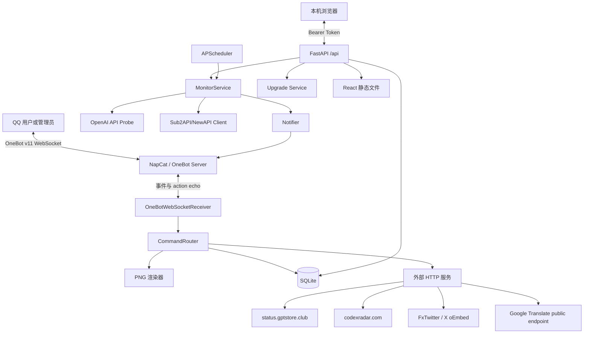
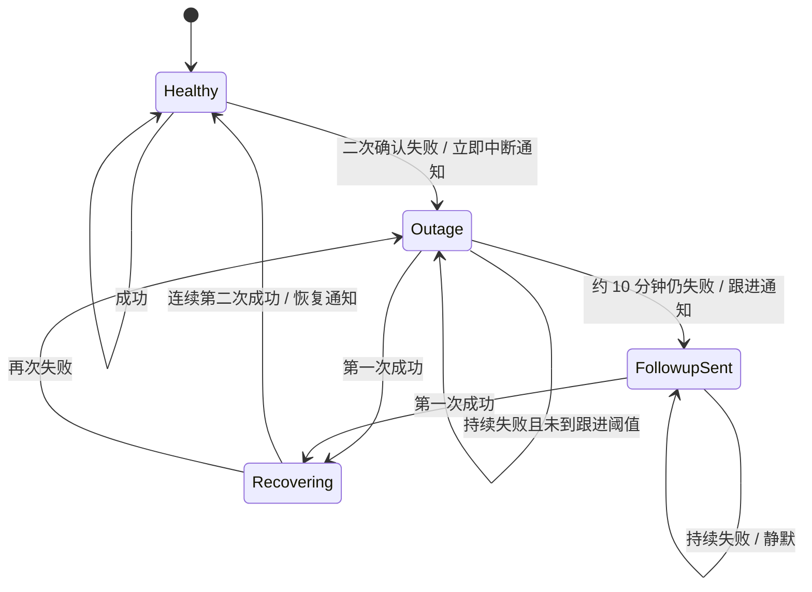

# APIMonitorBot 技术迁移与 Agent 交接文档

> 目标：将当前 APIMonitorBot 的功能、数据语义、外部协议、权限规则和工程约束迁移到新项目。本文以当前源码为准，不以历史聊天中的旧方案为准。

## 1. 项目概览

APIMonitorBot 是一个本机部署的 API 可用性监控和 OneBot 通知服务，主要能力包括：

- 定时探测多个 OpenAI Chat Completions 兼容 API。
- 对故障进行二次确认、模型回退、恢复确认和合并通知。
- 通过 OneBot v11 WebSocket 接收命令并发送文本或 PNG 图片。
- WebUI 管理 API、管理员、OneBot、命令开关、巡检参数和升级包。
- 监控 Sub2API/NewAPI 分组倍率及变动历史。
- 依据 Sub2API 实时 Token 单价计算 CNY/MTok 价格。
- 生成 API 状态图、检查结果图、价格图、网页快照、Codex Radar 和 Tibo Radar。
- 支持 WebUI 首次设置密钥、登录鉴权和本地一键升级。

当前默认管理员 QQ：`2087900785`。

## 2. 技术栈

### 后端

- Python 3.11+
- FastAPI
- Uvicorn
- SQLAlchemy 2.x
- SQLite
- APScheduler AsyncIOScheduler
- httpx
- websockets
- cryptography/Fernet
- Pillow
- Pydantic Settings

`requirements.txt` 当前包含 Alembic，但项目没有正式 Alembic 版本链；现有升级依靠 `Base.metadata.create_all()` 加少量 SQLite `ALTER TABLE` 兼容迁移。

### 前端

- React 19
- TypeScript 5.6
- Vite 7
- lucide-react
- 单页 WebUI，主要代码目前集中在 `frontend/src/main.tsx` 和 `frontend/src/styles.css`。

### 测试

- pytest
- pytest-asyncio
- 当前完整测试数量：`91`。

## 3. 系统架构



## 4. 启动生命周期

入口：`run.py`，创建 `backend.app.main:app`。

FastAPI lifespan 顺序：

1. `init_db()`：建表、执行 SQLite 小迁移、写入默认管理员。
2. 从 `app_settings` 表读取运行时覆盖项。
3. 创建 `OneBotClient`。
4. 创建 `OneBotNotifier`。
5. 创建 `MonitorService`。
6. 创建 `CommandRouter`。
7. 创建 `OneBotWebSocketReceiver` 并绑定到 `OneBotClient`。
8. 创建 `AsyncIOScheduler`。
9. 若 `CHECKER_ENABLED=true`，每 `CHECK_INTERVAL_SECONDS` 调用 `monitor.run_all_scheduled(SessionLocal)`。
10. 启动 OneBot WebSocket 接收器。
11. 关闭应用时停止 WebSocket，并停止 scheduler。

默认地址：`http://127.0.0.1:8000/`。

## 5. 关键文件地图

| 文件 | 职责 |
|---|---|
| `backend/app/main.py` | FastAPI 工厂、lifespan、鉴权中间件、静态资源挂载 |
| `backend/app/settings.py` | `.env` 设置模型 |
| `backend/app/db.py` | engine、SessionLocal、建表、SQLite 兼容迁移、默认管理员 |
| `backend/app/models.py` | 全部 ORM 模型 |
| `backend/app/schemas.py` | Web API Pydantic 输入输出 |
| `backend/app/api.py` | Web API 路由和兼容 webhook |
| `backend/app/commands.py` | OneBot 命令解析、权限、多轮对话、命令执行 |
| `backend/app/command_settings.py` | 命令定义、开关、别名解析和冲突检查 |
| `backend/app/onebot.py` | OneBot WebSocket 连接、action、echo、图片 CQ 码 |
| `backend/app/notifier.py` | 通知抽象、发送结果落库 |
| `backend/app/availability.py` | OpenAI 探测和 Google 连通性检查 |
| `backend/app/monitor.py` | 定时巡检、故障状态机、合并通知、倍率变动检测 |
| `backend/app/repository.py` | 通知目标、多目标、管理员、冷却、多轮会话、可用率 |
| `backend/app/status_bars.py` | 30 分钟/5 小时/24 小时状态桶 |
| `backend/app/status_image.py` | `/status` PNG |
| `backend/app/check_image.py` | `/check` 多配置 PNG |
| `backend/app/web_snapshot.py` | `/stat` Edge/Chrome CDP 全页截图 |
| `backend/app/sub2api.py` | Sub2API/NewAPI 登录、token、Cookie、倍率、实时价格目录 |
| `backend/app/sub2_rates.py` | 倍率同步、历史、删除/变动识别、最低关键词分组 |
| `backend/app/sub2_sentiment.py` | 全 Bot 每日看涨/看跌投票和比例聚合 |
| `backend/app/model_pricing.py` | 每 Token 单价转 CNY/MTok、Luna/Terra/Sol 模型匹配 |
| `backend/app/sub2_price_image.py` | `/price` 和倍率变动 PNG |
| `backend/app/codex_radar.py` | `/radar` 数据解析和趋势图 |
| `backend/app/tibo_radar.py` | `/tibo` X 帖子、回复链、翻译、动态高度 PNG |
| `backend/app/runtime_settings.py` | WebUI 修改 OneBot、夜间巡检和冷却并写入 SQLite |
| `backend/app/webui_auth.py` | WebUI 密钥哈希、Bearer token 签名和验证 |
| `backend/app/upgrades.py` | 升级包生成、验证、备份、安装和重启 |
| `frontend/src/main.tsx` | WebUI 状态、API 调用和组件 |
| `frontend/src/styles.css` | WebUI 样式和响应式规则 |
| `scripts/reset_webui_secret.py` | 重置 WebUI 密钥 |
| `scripts/build_upgrade_package.py` | CLI 生成升级包 |

## 6. 环境配置

```env
APP_HOST=127.0.0.1
APP_PORT=8000
APP_TIMEZONE=Asia/Shanghai
DATABASE_URL=sqlite:///./data/apimonitor.sqlite3

SECRET_MASTER_KEY=

ONEBOT_WS_URL=ws://127.0.0.1:3001
ONEBOT_ACCESS_TOKEN=
ONEBOT_WS_TOKEN_IN_QUERY=true

DEFAULT_ADMIN_QQ=2087900785
CHECK_INTERVAL_SECONDS=60
NIGHT_SAVER_ENABLED=true
NIGHT_SAVER_START_HOUR=0
NIGHT_SAVER_START_MINUTE=0
NIGHT_SAVER_END_HOUR=8
NIGHT_SAVER_END_MINUTE=0
NIGHT_SAVER_INTERVAL_SECONDS=600
COMMAND_CHECK_COOLDOWN_SECONDS=300
CHECK_RETRY_DELAY_SECONDS=5
REQUEST_TIMEOUT_SECONDS=20
API_PROBE_MODEL_FALLBACK_ENABLED=true
API_PROBE_FALLBACK_MODELS=gpt-5.4,gpt-5.4-mini
INTERNET_CHECK_URL=https://www.google.com/generate_204
INTERNET_CHECK_TIMEOUT_SECONDS=8
INTERNET_DISCONNECT_NOTIFY_COOLDOWN_SECONDS=600
CHECKER_ENABLED=true

STATUS_SNAPSHOT_URL=https://status.gptstore.club/
STATUS_SNAPSHOT_BROWSER_PATH=
STATUS_SNAPSHOT_TIMEOUT_SECONDS=45
STATUS_SNAPSHOT_VIEWPORT_WIDTH=1920

CODEX_RADAR_SOURCE_URL=https://codexradar.com/current.jsor
CODEX_RADAR_TIMEOUT_SECONDS=20
TIBO_RADAR_SOURCE_URL=https://codexradar.com/current.json
TIBO_RADAR_TIMEOUT_SECONDS=20
```

重要：

- `SECRET_MASTER_KEY` 生产环境必须设置。
- 未设置时当前代码使用固定 development fallback key，仅适合开发，迁移时应消除或显式禁止生产启动。
- WebUI 保存的 OneBot 与巡检参数存入 SQLite，并覆盖 `.env` 同名默认值。
- 历史 OneBot HTTP 字段仍在 Settings 中，但发送路径已经弃用 HTTP。

## 7. 数据库模型

### `api_configs`

- 唯一名称、BaseURL、加密 APIKey、模型名、启停状态。
- 当前状态：`unknown/ok/down`。
- 最近 code/error/time/latency。
- 故障状态机字段：首次故障、通知时间、十分钟跟进标记、连续失败数、连续成功数。

### `check_records`

- 归属 API 配置。
- 时间、状态、code、error、latency。
- `scheduled` 区分定时和手动检查。
- 状态条只统计 `scheduled=true`。

### `sub2_configs`

表名因兼容历史保留，但已同时承载 Sub2API 和 NewAPI：

- `upstream_type`：`sub2api/newapi/auto`。
- `credential_mode`：`password/token`。
- BaseURL、通知对象、账号。
- 加密密码、access token、refresh token、session Cookie。
- token 到期时间和 NewAPI user ID。
- 启停、最近检查和最近错误。

### `sub2_channel_rates`

- 当前分组倍率。
- 唯一键：`sub2_config_id + platform + group_key`。

### `sub2_rate_history`

- 每次首次发现、上海自然日首次成功同步或倍率变化时追加历史点。
- 日 K 直接从历史点聚合最近 30 天开、高、低、收；缺失日期不补值。
- 分组删除时当前行删除，历史保留。

### `sub2_sentiment_votes`

- 全 Bot 共用的整体 Token 倍率情绪投票。
- 唯一键：`user_id + vote_date`，日期固定按 `Asia/Shanghai`。
- 同日同方向幂等，反方向更新原记录；来源群或私聊只用于审计，不划分统计范围。

### 其他表

- `bot_admins`：管理员 QQ。
- `app_settings`：WebUI 密钥哈希、OneBot 运行时设置、夜间参数、冷却。
- `bot_command_settings`：命令开关和 JSON 别名。
- `conversation_states`：15 分钟多轮对话状态和 payload。
- `command_rate_limits`：用户+命令最后使用时间。
- `received_messages`：最近接收消息、是否触发、回复预览。
- `send_records`：发送成功/失败、短消息预览、错误和响应。

## 8. 密钥和 WebUI 鉴权

### 业务密钥

- 使用 Fernet。
- 任意非 Fernet 格式的主密钥先 SHA-256，再 URL-safe Base64 作为 Fernet key。
- APIKey、OneBot token、Sub2 密码/token、NewAPI Cookie 均加密落库。
- Web API 不返回明文业务密钥。

### WebUI 密钥

- 首次进入调用 `/api/webui/setup`。
- 密钥至少 8 字符。
- PBKDF2-HMAC-SHA256，260000 次，随机 16 字节 salt。
- 登录后 token 格式：`issued_at.nonce.hmac`。
- token 使用 WebUI 密钥哈希作为 HMAC key，TTL 7 天。
- 修改/重置 WebUI 密钥会使旧 token 失效。
- 除 setup/login/auth-status 外，所有 `/api` 路径经过 Bearer 中间件。

## 9. 通知目标格式

用户格式：

```text
G123456789
P2087900785
G123456789&P2087900785
```

内部：

- 单群：`target_type=group, target_id=群号`。
- 单私聊：`target_type=private, target_id=QQ号`。
- 多目标：`target_type=multi, target_id=G...&P...`。

解析会进行：

- HTML entity 反转义，兼容 `&amp;`。
- Unicode NFKC 规范化。
- 大写化。
- 去重。

## 10. OneBot v11

### 连接

- 只使用 WebSocket Server 模式。
- 请求头：`Authorization: Bearer <token>`。
- 可选 query：`?access_token=<token>`。
- 断线后默认 2 秒重连。
- 兼容 websockets 新旧参数：`additional_headers/extra_headers`。

### action

发送格式：

```json
{
  "action": "send_group_msg",
  "params": {"group_id": 123, "message": "..."},
  "echo": "random"
}
```

- pending future 以 echo 关联回执。
- action 写操作受 `_send_lock` 串行保护。
- 收到非 echo 事件时创建独立 handler task，避免长命令阻塞 WebSocket 接收循环。
- echo 超时被视为“可能已发送成功”，返回 `ok=true` 和 `ack_timeout=true`，避免重复补发。
- OneBot `status=failed` 或异常 retcode 才视为失败。

### 图片

- 使用 CQ：`[CQ:image,file=base64://...]`。
- SQLite 只记录 `[image:filename.png]`，绝不存完整 Base64。

### HTTP webhook

- `/onebot/webhook` 只返回 ignored。
- 不处理事件，避免 HTTP 与 WebSocket 双重触发和重复发送。

## 11. 命令系统

| 命令 | 权限与行为 |
|---|---|
| `/addapi` | 管理员，多轮添加 OpenAI API |
| `/addsub2` | 管理员，多轮添加 Sub2API |
| `/list` | 管理员，列出 API 配置 |
| `/remove <name>` | 管理员，删除 API 配置 |
| `/check [name]` | 群普通用户仅本群配置；无参数多项时发 PNG |
| `/status [name]` | 状态条 PNG |
| `/stat` | GPTStore 状态页全页截图 |
| `/price` | Sub2API 分组倍率、历史和实时 CNY/MTok 价格图 |
| `/up`、`up` | 全 Bot 当日整体 Token 倍率看涨投票 |
| `/down`、`down` | 全 Bot 当日整体 Token 倍率看跌投票 |
| `/radar` | Codex Radar 模型 IQ 趋势和排名图 |
| `/tibo` | Tibo 最新 X 帖、翻译、回复原帖和 presence 图 |
| `/cancel` | 取消多轮对话，不受开关限制 |

### 命令开关和别名

- `COMMAND_DEFINITIONS` 是唯一已知命令清单。
- 除 `/cancel` 外均受 WebUI 开关控制。
- 别名不带 `/`，无空白，单命令最多 16 个，单别名最长 32 字符。
- 别名跨命令不能冲突。
- 普通文本第一个词与别名相等时解析为对应命令。
- `up`、`down` 是不可移除的默认别名，并优先于旧数据库中的冲突自定义别名。

### 冷却

- 普通用户：`/check /status /stat /price /radar /tibo` 默认 5 分钟。
- 管理员永不冷却。
- 冷却为 0 表示关闭限制。
- 冷却键按用户和命令隔离。

### 权限

- 群普通用户只能访问通知目标包含本群的配置。
- 管理员在群里可使用信息类命令，即使该群未绑定。
- 私聊默认仅管理员。
- `/status` 无参数时，管理员私聊可看全部 API。

## 12. 多轮添加流程

### `/addapi`

状态：`name -> target -> base_url -> api_key -> model_name`。

- APIKey 必须在私聊输入。
- BaseURL 必须是 HTTP(S)。
- 保存前 POST `{BaseURL}/chat/completions`，消息为 `hi`。
- 验证成功才入库。
- 会话 TTL 15 分钟。

### `/addsub2`

状态：`sub2_name -> sub2_base_url -> sub2_email -> sub2_password -> sub2_target`。

- 密码步骤立即登录和读取分组。
- 成功后再收通知目标。
- 首次倍率入库不发送变动通知。

## 13. API 可用性探测

请求：

```http
POST {BaseURL}/chat/completions
Authorization: Bearer <APIKey>
Content-Type: application/json

{
  "model": "...",
  "messages": [{"role": "user", "content": "hi"}],
  "temperature": 0
}
```

必须保留：

- 不发送 `max_tokens/max_output_tokens`。
- `verify_ssl=False`。
- 2xx + JSON + 非空 assistant content 才成功。
- content 可为字符串或文本数组。

错误 code：

- HTTP 状态字符串。
- `TIMEOUT`
- `NETWORK_ERROR`
- `INVALID_JSON`
- `EMPTY_ASSISTANT_CONTENT`
- `INVALID_BASE_URL`

定时检查时：

- 首次失败后等待 `CHECK_RETRY_DELAY_SECONDS`，立即二次检查。
- 二次结果用于判定。
- `400/404/429/EMPTY_ASSISTANT_CONTENT` 可触发模型回退。
- 模型名含 `5.5` 时优先替换成 `5.4`，然后尝试配置候选列表。
- 回退模型成功后持久化新模型，本轮记成功且不告警。

## 14. TIMEOUT 和 NETWORK_ERROR

- 两者不写 `check_records`。
- 两者不改变 API 状态或成功率。
- 两者不向业务通知目标发送中断。
- `NETWORK_ERROR` 静默。
- `TIMEOUT` 会额外检查 Google `generate_204`。
- Google 也失败时只私聊默认管理员“当前国际互联网连接断开”。
- 国际网络断开通知默认 10 分钟冷却。

## 15. 故障状态机



- 默认十次基础巡检后跟进。
- 夜间间隔变长时，阈值按实际巡检间隔折算，目标仍约 10 分钟基础窗口。
- 恢复默认连续 2 次成功。
- 同一轮同一通知目标多个 API 状态变化会合并为一条消息。
- 多通知目标分别投递。

## 16. 可用率和状态条

默认窗口：

- 最近 30 分钟：1 分钟一格。
- 最近 5 小时：10 分钟一格。
- 最近 24 小时：60 分钟一格。

颜色：

- `unknown` 灰：无记录。
- `ok` 绿：桶内全成功。
- `partial` 黄：成功和失败并存。
- `down` 红：桶内全失败。

注意当前技术债：

- UI 文案为“最近请求成功率”。
- 实际函数仍叫 `today_availability()`，统计 `Asia/Shanghai` 当天的定时记录，而非滚动窗口。
- 新项目需要明确是保留自然日语义，还是迁移为真正的滚动“最近 N 次/最近 N 小时”。

## 17. 夜间省流

- Scheduler 本身仍每分钟触发。
- Sub2API 倍率巡检每次 scheduler tick 都执行，不受夜间省流跳过影响。
- OpenAI API 巡检通过 `MonitorService.should_run_scheduled()` 控制实际执行间隔。
- 默认 `00:00-08:00` 每 10 分钟探测，其余每分钟。
- WebUI 修改后立即写 SQLite 并更新当前 Settings 对象。

## 18. Sub2API 与 NewAPI

### Sub2API 登录

```http
POST {BaseURL}/api/v1/auth/login
{"email":"...","password":"..."}
```

返回 access token、refresh token、expires_in。

刷新：

```http
POST {BaseURL}/api/v1/auth/refresh
{"refresh_token":"..."}
```

分组监控：

```http
GET {BaseURL}/api/v1/groups/available
Authorization: Bearer <access_token>
```

### `/price` 实时定价

```http
GET {BaseURL}/api/v1/channels/available
Authorization: Bearer <access_token>
```

解析：

- `data[].platforms[].groups[]`
  - `id`
  - `name`
  - `platform`
  - `rate_multiplier`
- `data[].platforms[].supported_models[]`
  - `name`
  - `platform`
  - `pricing.billing_mode`
  - `pricing.input_price`
  - `pricing.output_price`
  - `pricing.cache_write_price`
  - `pricing.cache_read_price`

只接受 `billing_mode=token` 和非负数值。

价格字段是每 Token 计价单位。Sub2API 语义为 `1 CNY = 1 USD 计价单位`，不乘外汇汇率：

```text
CNY/MTok = per_token_price × 1,000,000 × rate_multiplier
```

示例：

```text
input_price = 0.0000025
output_price = 0.000015
cache_write_price = 0
cache_read_price = 0.00000025
rate_multiplier = 0.15

输入 = 0.375 CNY/MTok
输出 = 2.25 CNY/MTok
缓存写入 = 0
缓存读取 = 0.0375 CNY/MTok
```

Luna/Terra/Sol 关键词只用于从接口返回的模型中筛选，不允许内置静态单价。

### NewAPI

登录：

```http
POST {BaseURL}/api/user/login
{"username":"...","password":"..."}
```

密码模式：

- 保存响应 Cookie。
- 保存 `data.id`。
- 分组请求带 `Cookie` 和 `New-Api-User`。

Token 模式：

- `Authorization: <access_token>`，注意当前实现不是强制 Bearer。
- `New-Api-User: <user_id>`。

分组：

```http
GET {BaseURL}/api/user/self/groups
```

返回 map，key 为 group key，`desc` 为显示名，`ratio` 必须是数值；`"自动"` 等非数值 ratio 跳过。

### 批量导入

- Web API：`POST /api/upstream-groups/import`。
- 多行 URL。
- 自动以 hostname 生成唯一名称。
- 导入后 `enabled=false`、无凭据，不产生巡检告警。
- `POST /api/sub2/{name}/login` 补登录并启用。
- 自动模式先尝试 Sub2API，再尝试 NewAPI。

## 19. 倍率历史和变动通知

- 首次发现分组：写当前表和历史表，不通知。
- 倍率变化：追加历史并生成 change。
- 分组消失：生成 deleted change，删除当前行，保留历史。
- 变动时先发 PNG，再发文字说明。
- OpenAI 分组绿色，Anthropic 分组橙色。
- 上涨红、下跌绿。
- `/price` 图片完整展开。
- WebUI、`/price` 和自动变动图同时保留折线与最近 30 天日 K，并在顶部显示全 Bot 当日情绪比例。

当前限制：

- 定时倍率变动图使用 `/groups/available`，没有实时模型价格目录，因此变动图的模型价格区可能为空。
- `/price` 命令会实时请求 `/channels/available`，价格完整。
- WebUI `/api/sub2/prices` 当前只返回倍率和历史，不返回实时模型 Token 单价。

## 20. `/stat` 网页快照

- 目标：`status.gptstore.club`。
- 使用本机 Edge/Chrome DevTools Protocol。
- 不依赖 Playwright 浏览器下载。
- 切换到“1 小时”成功率视图。
- 截取全页。
- 普通用户冷却，管理员免冷却。

## 21. `/radar`

- 配置地址历史上是 `current.jsor`。
- 该 URL 实际返回 HTML。
- 客户端检测 JSON 解析失败后自动回退到 `/current.json`。
- 解析 `model_iq.latest/recent_days/comparisons/quota_radar`。
- 主配置加 comparison 共可形成 9 条曲线。
- 最近 7 个测试批次。
- Max 使用粗实线，其他推理强度使用虚线。
- 显示排名、通过数、成本、中位数、最高分和总成本。
- 必须保留 `codexradar.com/current.json` 来源署名。

## 22. `/tibo`

数据链：

1. 请求 `codexradar.com/current.json`。
2. 读取 `tibo_presence`。
3. 从 `source_url` 或 `source_urls[0]` 提取 X username/status ID。
4. 请求 `api.fxtwitter.com/{user}/status/{id}` 获取完整帖子和头像。
5. FxTwitter 失败时回退 X oEmbed；oEmbed 长帖可能截断。
6. 使用 Google Translate public endpoint 翻译中文。
7. 翻译失败时使用 `tibo_presence.evidence_summary_zh` 作为中文摘要。

回复链：

- 若存在 `replying_to/replying_to_status`，继续请求被回复的原帖。
- 图片展示 Tibo 回复原文/翻译及原帖原文/翻译。

评论：

- 代码支持公开响应中的 `comments/reply_tweets/replies_data/conversation_replies`。
- 最多 3 条。
- 过滤敏感词、HTTP 链接、少于 2 字或超过 280 字内容。
- 当前 FxTwitter 通常只返回评论数量，不返回评论正文，因此评论区是可选增强。

图片：

- 白底 X 风格。
- 虚线外框。
- 右侧 presence：粗粒度位置、概率、置信度、依据、更新时间、安全说明。
- 高度按正文、翻译、原帖和评论实际行数计算。
- 最低 1600x1080，长内容向下扩展。
- 内容底部额外保留 150px 页脚安全区，禁止与来源文字重叠。

## 23. Web API 路由

### 公开鉴权入口

- `GET /api/webui/auth-status`
- `POST /api/webui/setup`
- `POST /api/webui/login`

### 设置

- `GET/PUT /api/settings/onebot`
- `GET/PUT /api/settings/monitoring`
- `GET /api/settings/commands`
- `PATCH /api/settings/commands/{command}`

### API 配置

- `GET /api/configs`
- `POST /api/configs`
- `PATCH /api/configs/{name}`
- `DELETE /api/configs/{name}`
- `POST /api/configs/{name}/check`
- `GET /api/configs/{name}/history`，最多 60 条。
- `GET /api/status-bars`

### 上游倍率

- `GET /api/sub2/prices`
- `GET /api/sub2/sentiment`
- `POST /api/upstream-groups/import`
- `POST /api/sub2/{name}/login`

### 运维

- `GET /api/messages/recent`，最多 10 条。
- `GET /api/sends/recent-failures`，最多 10 条。
- `GET/POST /api/admins`
- `DELETE /api/admins/{qq}`，禁止删除最后一个管理员。
- `GET /api/status`

### 升级

- `GET /api/upgrade/status`
- `POST /api/upgrade/inspect`
- `POST /api/upgrade/install`
- `GET /api/upgrade/package`

### OneBot 兼容

- `POST /onebot/webhook`：始终 ignored。

## 24. WebUI

WebUI 是紧凑的深色运维面板，不是营销页。

当前功能：

- 首次设置 WebUI 密钥。
- 登录/退出。
- 右上角 GitHub 链接。
- 快速上手和 NapCat WebSocket Server 教程。
- OneBot WS 设置及连接状态。
- API 新增、删除、启停、改名、改模型、改通知对象、手动检查。
- API 状态、最近成功率、最近检查时间和状态条。
- 巡检历史最多 60 条，可折叠。
- Sub2/NewAPI 倍率、历史折线、30 日日 K 和全局情绪比例，分组默认折叠。
- 批量导入上游，后续补登录。
- 命令开关和别名。
- 管理员管理。
- 最近消息和触发高亮。
- 最近发送失败。
- 夜间范围、夜间间隔和普通用户冷却。
- 升级包拖拽、检查、安装、自动重启、在线生成。

折叠状态使用 localStorage 持久化。

前端限制：

- 当前没有路由拆分。
- `main.tsx` 很大，新项目应按领域拆成 hooks、API client、types 和组件目录。
- WebUI 当前没有显示 `/price` 的实时 Token 单价，仅显示倍率历史。

## 25. 升级包

- ZIP 最大 100 MB。
- 解压后最大 250 MB。
- 最多 5000 文件。
- 必须包含唯一 `upgrade-manifest.json`。
- manifest 每个文件记录 path、size、SHA-256。
- 白名单根文件和目录。
- 禁止 `.env/data/.git/.venv/node_modules/release/cache/db/log/zip`。
- 安装前备份被覆盖文件到 `data/upgrades/backups/`。
- 不覆盖 `.env` 和 `data/`。
- requirements 变化时可安装依赖。
- 支持安装后调度独立重启脚本。

迁移时必须保留路径穿越、symlink、压缩炸弹、重复文件和 hash 校验防护。

## 26. 测试和验证

后端：

```powershell
.\.venv\Scripts\python.exe -m pytest
.\.venv\Scripts\python.exe -m compileall -q backend run.py scripts tests
```

前端：

```powershell
cd frontend
npm run build
```

主要测试域：

- API CRUD、历史限制和 webhook ignored。
- URL 拼接、JSON、空 assistant、模型回退。
- 命令权限、别名、冷却、多目标和多轮流程。
- OneBot WebSocket token、echo、超时语义。
- 监控故障、十分钟跟进、恢复、合并通知。
- 状态条聚合。
- Sub2API/NewAPI 登录和价格目录。
- CNY/MTok 公式。
- Codex Radar/Tibo Radar 解析和 PNG。
- Tibo 长内容动态高度。
- WebUI auth。
- 升级包安全检查。

## 27. 作为主项目子功能的兼容迁移

新项目中的 APIMonitorBot 应作为一个可插拔业务子功能接入，而不是在主项目进程内原样启动第二套完整应用。迁移前先盘点主项目已经具备的能力，并遵守以下原则：

### 27.1 优先复用主项目能力

如果主项目已经提供同类能力，优先编写适配层并复用：

| 能力 | 迁移方式 |
|---|---|
| FastAPI 应用与生命周期 | 注册 APIMonitorBot router 和 lifespan hook，不再创建第二个 Uvicorn 进程 |
| 登录、用户和 RBAC | 映射到主项目身份与权限系统；保留 QQ 管理员作为 OneBot 命令权限来源 |
| 数据库与 Alembic | 将模型迁入主项目 migration 链，使用独立表前缀或 schema，避免继续运行 SQLite `ALTER TABLE` 补丁 |
| 任务调度器 | 向主调度器注册唯一 job，不再启动第二个 APScheduler |
| OneBot WebSocket | 复用主项目唯一连接，通过 action/echo 适配器发送消息，禁止两个客户端同时消费事件 |
| 通知系统 | 将 `Notifier` 接口适配到主项目通知总线，保留 OneBot 目标 `G...`/`P...` 语义 |
| 密钥管理 | 使用主项目 KMS/Secret Service；迁移旧数据时解密后立即用新体系重新加密 |
| WebUI | 将页面挂入主项目导航和鉴权体系，不重复实现登录页、顶栏或升级中心 |
| 日志、指标和健康检查 | 接入主项目观测体系，并给日志、指标、job id 增加 `api_monitor` 命名空间 |
| 升级机制 | 主项目已有发布/升级流程时弃用 APIMonitorBot 自更新，只随主项目版本发布 |

### 27.2 应保留的领域模块

以下代码承载本功能的核心行为，可以迁移后继续使用，或在保持测试语义的前提下重写：

- `availability.py`：OpenAI 兼容 API 探测和结果分类。
- `monitor.py`：失败确认、模型回退、恢复确认、合并通报和 Sub2API 定时任务。
- `commands.py`：命令语义、多轮会话、权限边界、别名和冷却。
- `sub2api.py`、`sub2_rates.py`、`model_pricing.py`：登录、倍率、删除检测和实时模型价格。
- `status_bars.py` 及所有 `*_image.py`/Radar 模块：聚合与图片输出。
- 目标解析、SecretBox 数据迁移逻辑和对应测试。

### 27.3 推荐集成边界

建议在主项目建立 `api_monitor` 模块，并提供以下端口或适配器：

- `ConfigRepository`：配置、巡检记录、倍率历史和运行时设置读写。
- `SecretStore`：APIKey、密码、Cookie 和 token 加解密。
- `MessageTransport`：接收 OneBot 事件，发送 action 并按 echo 关联回执。
- `Notifier`：文本、图片和多目标通知。
- `SchedulerPort`：注册/移除唯一命名的周期任务。
- `IdentityPort`：判断 Web 用户、QQ 用户和管理员权限。
- `Clock`：统一 `Asia/Shanghai` 时间和可测试的当前时间。

HTTP 路由建议挂载到 `/api/api-monitor/*`，前端路由建议挂载到 `/api-monitor`。表名、缓存键、调度任务 ID、WebSocket echo 和日志字段都应使用 `api_monitor` 前缀，避免与主项目已有功能冲突。

### 27.4 两种运行模式

- `standalone`：保留当前 FastAPI、SQLite、WebUI auth、APScheduler 和 OneBot WS，供独立部署。
- `embedded`：由主项目注入数据库、身份、调度、通知和 OneBot 连接；不启动本项目自己的服务器、调度器、WebUI 登录或自更新。

不要仅靠环境变量在同一进程中启动两套实现。应用组装阶段必须保证每类基础设施只有一个 owner，尤其是 OneBot receiver 和定时巡检 job。

### 27.5 兼容迁移验收

- 同一 OneBot 事件只进入一次命令路由，同一 action 只发送一次。
- 主项目重启、热更新或多 worker 部署时，仅一个实例持有 scheduler/OneBot leader 身份。
- 旧 SQLite 数据可映射到新表；密文必须重新加密，不能直接复制依赖旧主密钥的密文字段。
- 主项目已有同名命令时有明确命名空间、别名或路由优先级，不允许静默覆盖。
- 主项目已有 API 监控时，优先迁移本项目特有状态机和图片/命令能力，不重复探测同一上游。
- 独立模式和嵌入模式共用领域测试；基础设施适配器分别做集成测试。

## 28. 迁移顺序建议

1. 建立新项目目录、依赖、Settings 和日志。
2. 迁移数据库模型，并立即引入正式 Alembic migrations。
3. 迁移 SecretBox、WebUI auth 和目标解析。
4. 迁移 OneBot WS receiver/client，先通过 echo 和超时测试。
5. 迁移 ApiProbe 和 MonitorService 状态机。
6. 迁移命令定义、权限、冷却和多轮会话。
7. 迁移 Sub2API/NewAPI 客户端和倍率历史。
8. 迁移 `/channels/available` 实时价格公式。
9. 迁移所有 Pillow 渲染器和动态高度算法。
10. 迁移 Web API。
11. 拆分并迁移 React WebUI。
12. 迁移升级包机制。
13. 导入旧 SQLite 数据或编写一次性转换器。
14. 运行完整测试并与旧项目并行对比至少一个巡检周期。

## 29. 新项目必须保留的不变量

- OneBot 发送和接收只走一个 WebSocket，不能恢复 HTTP 双发送。
- action echo 超时不补发，避免实际已发送时重复消息。
- APIKey/token/Cookie/password 不明文落库或返回。
- `TIMEOUT/NETWORK_ERROR` 不计入可用率。
- 探测请求不带输出长度参数。
- `verify_ssl=False` 保持当前兼容行为，除非提供配置化迁移方案。
- 多通知目标必须逐个投递。
- 管理员免命令冷却。
- 普通群用户只能访问本群绑定配置。
- 图片 Base64 不写 SQLite。
- `/price` 单价只能来自 `/channels/available`。
- Sub2API 价格公式不使用外汇汇率。
- 状态条只统计定时记录。
- Tibo 图片必须动态高度并保留页脚安全区。
- 不提交 `.env/data/.venv/node_modules/dist/release/log/db`。

## 30. 已知技术债和迁移决策

1. 项目依赖 Alembic，但目前没有正式 migration 链。
2. `today_availability` 与“最近请求成功率”文案语义不完全一致。
3. `frontend/src/main.tsx` 过大。
4. `SecretBox` 未设置主密钥时有固定开发 fallback。
5. Settings 中仍存在弃用的 OneBot HTTP 配置字段。
6. Sub2 定时变动图不拉取实时模型价格。
7. WebUI 不显示实时 CNY/MTok 模型价格。
8. Tibo 评论正文依赖第三方公开接口是否提供。
9. Google Translate 和 FxTwitter 是非正式外部依赖，应设置缓存、超时和可替换 provider。
10. `CODEX_RADAR_SOURCE_URL` 默认故意保留历史 `.jsor`，运行时自动回退；新项目可以直接改为 `.json`。
11. 当前工作区可能包含未提交改动，迁移必须以文件内容和测试结果为准，不能只依赖 Git 历史。

## 31. 给下一个 Agent 的编程工具与工作方式

### 推荐工具

- 文件搜索：`rg`、`rg --files`。
- 手工修改：`apply_patch`。
- Python 验证：项目 `.venv` 中的 Python、pytest、compileall。
- 前端：Node.js、npm、Vite build。
- WebUI 人工验证：浏览器开发者工具或 `browser:control-in-app-browser`。
- UI 改动：先读取并遵守 `ui-ux-pro-max` skill。
- OpenAI 官方 API 事实：使用 `openai-docs` skill，只使用官方文档。
- PNG 视觉验证：Pillow 生成后用本地图片查看工具检查；不仅验证文件非空。
- SQLite 调试：SQLAlchemy/SQLite CLI，禁止直接猜 schema。
- HTTP 调试：httpx/curl/PowerShell `Invoke-WebRequest`，保存脱敏证据。

### 不要使用的方式

- 不要用 Bash heredoc 运行 Windows PowerShell 项目。
- 不要用临时 Python 脚本覆写源码。
- 不要回滚用户已有改动。
- 不要启动第二套启用 scheduler/OneBot 的服务长期运行，否则会重复通知。
- 不要把真实 token、Cookie、QQ 群号、数据库或截图提交到公开仓库。

### 可直接交给下一个 Agent 的提示词

```text
你正在迁移 APIMonitorBot 到一个新项目。

先阅读：
1. AGENTS.md
2. TECHNICAL_MIGRATION_HANDOFF.md
3. README.md
4. backend/app/main.py、models.py、commands.py、monitor.py、onebot.py

要求：
- 以现有测试和源文件为行为真相。
- 不回滚或覆盖用户已有改动。
- 先识别主项目已有能力，再按 TECHNICAL_MIGRATION_HANDOFF.md 的嵌入式边界和迁移顺序实施。
- 优先迁移数据语义、OneBot echo 行为、故障状态机和权限边界，再迁移 UI。
- 为新数据库建立正式 Alembic migration。
- 每个阶段运行 pytest/compileall，前端运行 npm run build。
- 所有新增文件使用 UTF-8。
- 图片功能必须实际渲染并视觉检查长短内容。
- 完成后输出修改文件、验证命令、结果和未解决风险。

编程工具优先级：
rg/rg --files -> 读取源码 -> apply_patch -> pytest/compileall/npm build -> 浏览器或图片视觉检查。
```

## 32. 最终迁移验收清单

- [ ] 旧管理员和配置可导入。
- [ ] 所有密钥可用新主密钥重新加密。
- [ ] OneBot 单 WebSocket 收发正常。
- [ ] 收一条命令只触发一次回复。
- [ ] echo 超时不会重复补发。
- [ ] API 正常、失败、超时、网络错误和空内容行为一致。
- [ ] 首次故障、十分钟跟进、两次恢复状态机一致。
- [ ] 同目标多 API 告警合并。
- [ ] 多目标逐个通知。
- [ ] `/check /status /stat /price /radar /tibo` 可生成图片。
- [ ] `/price` 示例计算得到 `0.375/2.25/0/0.0375 CNY/MTok`。
- [ ] `/tibo` 长原帖不覆盖页脚。
- [ ] 普通用户权限和 5 分钟冷却正确。
- [ ] 管理员免冷却。
- [ ] WebUI setup/login/token 过期正确。
- [ ] WebUI 所有卡片、折叠和 CRUD 正常。
- [ ] 升级包无法覆盖 `.env/data` 或越界路径。
- [ ] 完整 pytest、compileall、npm build 通过。
- [ ] 发布包不含私密或本地数据。
